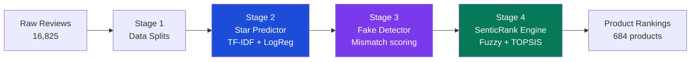

# SenticRank V2

Hybrid ML system for trust-weighted product ranking on Kaspi.kz marketplace.
Combines a bilingual star-rating predictor, fake-review detector, and a 5-criteria
TOPSIS ranking engine to produce scores that go beyond raw star averages.

**Dataset:** 16,825 reviews · 684 products · 9 categories · Russian + Kazakh

---

## Architecture



---

## Key Results

### Star Predictor (Stage 2)
| Model | Accuracy | F1-macro | QWK |
|-------|----------|----------|-----|
| Dummy baseline | 0.793 | 0.177 | 0.000 |
| TF-IDF + LogReg | **0.832** | **0.422** | **0.787** |
| TF-IDF + SVM | 0.863 | 0.390 | 0.783 |

Best model: **TF-IDF + LogReg** (selected by F1-macro). Bilingual — Russian 4/4, Kazakh 4/5 exact match.

### Fake Detection (Stage 3)
| Label | Count | % |
|-------|-------|---|
| Clean | 16,155 | 96.0% |
| Suspicious | 33 | 0.2% |
| Very suspicious | 62 | 0.4% |
| **Total removed** | **95** | **0.57%** |

### Ranking Engine (Stage 4)
- AHP Consistency Ratio: **CR = 0.0151** (< 0.10 ✓)
- Spearman ρ vs star baseline: **0.465** (diverges meaningfully — captures quality beyond stars)
- Pearson corr avg_star ↔ senticrank_100: **0.619**
- **Example:** iPhone 13 → SenticRank #1 in Smartphones (star rank: #3)

---

## Quick Start

```bash
# 1. Install
pip install -e ".[dev]"

# 2. Place raw data
cp your_reviews.csv data/raw/kaspi_reviews.csv

# 3. Run full pipeline
python scripts/prepare_data.py          # Stage 1: splits
senticrank train                        # Stage 2: train predictor
senticrank detect-fakes                 # Stage 3: fake detection
senticrank rank                         # Stage 4: produce rankings
```

Tests:
```bash
pytest -q   # 43 tests, ~5 seconds
```

---

## Output Artifacts (committed)

| File | Description |
|------|-------------|
| `data/outputs/star_predictor/test_metrics.json` | Per-model test metrics |
| `data/outputs/star_predictor/test_metrics.csv` | Same as CSV |
| `data/outputs/star_predictor/*_confusion_matrix.json` | Per-model confusion matrices |
| `data/outputs/fake_detector/fake_analysis.json` | Full fake detection stats |
| `data/outputs/fake_detector/top_fake_examples.csv` | Top-20 suspicious reviews |
| `data/outputs/ranking/senticrank_product_rankings.csv` | Final 684-product ranking |
| `data/outputs/ranking/category_rankings/*.csv` | Per-category rankings (9 files) |

---

## Docs

- [Final statistics](docs/final_statistics.md)
- [Fake detection methodology](docs/fake_detection_results.md)
- [Bilingual validation](docs/bilingual_validation.md)
- [Ranking calibration](docs/ranking_calibration.md)
- [Lessons learned](docs/lessons_learned.md)

---

## Project Structure

```
senticrank/
├── src/senticrank/
│   ├── star_predictor/   # TF-IDF + LogReg/SVM pipeline
│   ├── fake_detector/    # Mismatch-based fake scoring
│   ├── ranking/          # Fuzzy logic + AHP + TOPSIS
│   └── data/             # Loader, splitter
├── tests/                # 43 pytest tests
├── configs/default.yaml  # AHP weights, thresholds
├── docs/                 # Methodology + results docs
└── data/outputs/         # Small result artifacts (committed)
```
